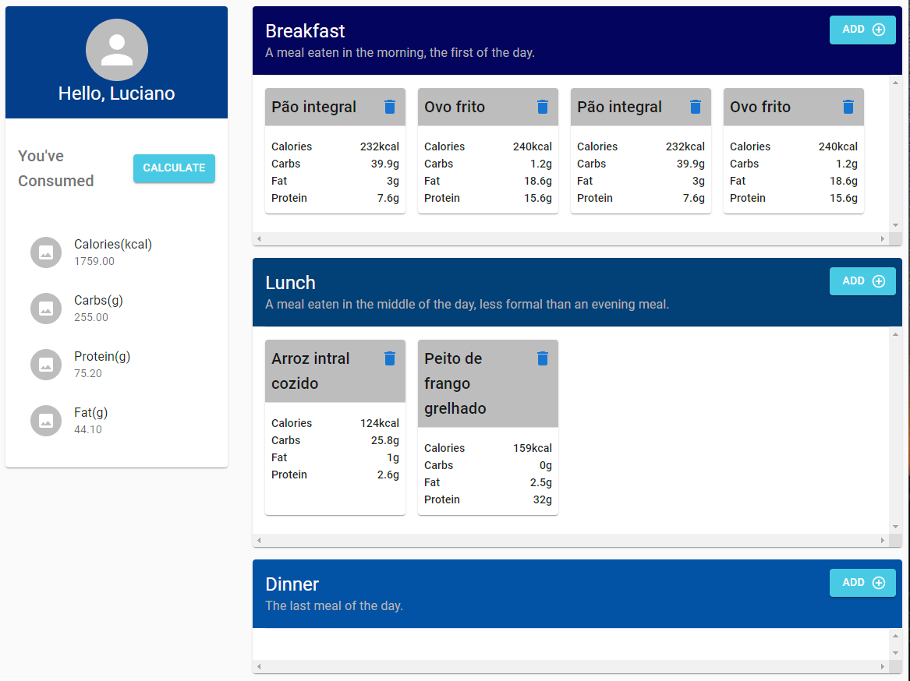

# Food Calculator 🥦
Project to pratice react state manager

## Preview ▶
Sample preview of this project

## This project use 🔨
- [React](https://reactjs.org/)
- [Zustand](https://github.com/pmndrs/zustand/tree/main/src)
- [Vite](https://vitejs.dev)
- [Typescript](https://www.typescriptlang.org/)
- [MaterialUI](https://mui.com/)

## Usage 🏃‍♂️
1. Clone the repository
2. yarn install
3. yarn dev
4. Open http://localhost:3000